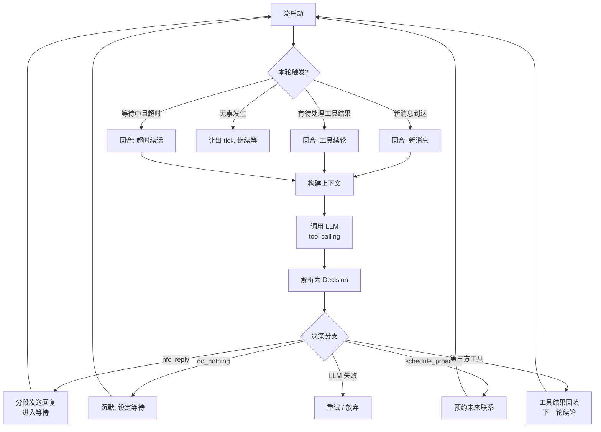

# Neo Fatum Chatter

> *Fatum —— 拉丁语中的「命运」。不是预定的结局，而是每个念头汇成的流向。*

**NFC 是一个让 AI 以「连续心理活动」的方式与人对话的私聊聊天器。** 它不把对话当作一问一答的任务，而是模拟一个有内心世界的人：说完话会等、会回想、会走神、会主动想起你——每一次回复背后都有一条连贯的心迹。

| 属性 | 值 |
|---|---|
| 插件名 | `neo_fatum_chatter` |
| 版本 | v2.5.9 |
| 适用场景 | 私聊（`ChatType.PRIVATE`） |
| 许可证 | AGPL-3.0 |

---

## 目录

1. [它解决什么问题](#它解决什么问题)
2. [核心设计：心理活动流](#核心设计心理活动流)
3. [对话循环如何运转](#对话循环如何运转)
4. [特性速览](#特性速览)
5. [安装](#安装)
6. [配置](#配置)
7. [LLM 工具（Actions）](#llm-工具actions)
8. [事件与外部集成](#事件与外部集成)
9. [项目结构](#项目结构)
10. [开发与测试](#开发与测试)
11. [FAQ](#faq)

---

## 概述

NFC 是面向私聊场景的 Chatter 插件。核心设计是把 LLM 的每次决策与内心独白（MentalLog）绑定，形成连续的心理活动流。对话历史与内心活动按时间线交织，让模型回复时不仅看到说了什么，还能"回想起"当时在想什么。


---

## 它解决什么问题

传统聊天机器人是「刺激 → 反应」：

```text
用户发消息 ──► 模型生成回复 ──► 发送 ──► 等用户再发
```

这种模式下，AI 没有"状态"：不知道对方沉默意味着什么，不会主动想起谁，回复之间缺乏心理连续性。你得到的是一个永远在线、永远秒回、永远不累的客服。

NFC 试图还原的，是**一段真实私人关系的时间结构**：

```text
        说了一句话
        │ 期待对方反应
        ▼
   ┌─ 等待 ─────────────────┐
   │  • 对方回了 → 继续聊    │
   │  • 对方沉默 → 内心活动  │
   │    （是追问？是等？）    │
   │  • 沉默太久 → 主动想起  │
   │    （预约的时刻到了吗）  │
   └────────────────────────┘
```

它在每一次决策时都留下「内心独白」，把零散的对话编织成一条连续的心理活动流——让回复不仅是"对消息的反应"，更是"此刻这个人在想什么"的外化。

## 核心设计：心理活动流

NFC 把对话拆成两层并行的时间线：

| 层 | 内容 | 作用 |
|---|---|---|
| **对话层** | 双方实际发送的消息 | 对方看到的内容 |
| **心理层（MentalLog）** | 每次决策前的 `thought`（内心想法）、`expected_reaction`（预期反应）、`mood`（心情）、等待时长、沉默时间 | 模型"回想"时的线索 |

两层交织后一起进入下一次 LLM 上下文。模型回复时不仅看到"对方说了什么"，还能"回想起自己当时在想什么"——这正是连续人格感的来源。

**实现载体：** 每个私聊对象对应一个 `NFCSession`（持久化在磁盘），包含：

- `mental_log`：心理活动流（上限 `max_log_entries` 条）
- `chain_payloads`：LLM 上下文持久化链（上限 `max_context_payloads` 对）
- `waiting_config`：当前等待状态（开始时间 / 期望时长 / 当时想法）
- `scheduled_proactive_at`：模型预约的下次主动联系时间
- `user_habits`：模型对对方习惯的观察记录
- `request_snapshot`：最近一次实际发送的完整请求体

## 对话循环如何运转

NFC 的主循环由 `runtime/orchestrator.py` 驱动，每一轮先判定**触发原因**，再决定是否调用 LLM：



触发原因由 `domain/turn_trigger.py` 分类（`NEW_MESSAGES` / `FOLLOWUP_TOOL_RESULT` / `TIMEOUT_EXPIRED` / `IDLE_WAIT`），整个循环产出统一的内部决策对象 `Decision`（`domain/decision.py`）。

### 三个关键节奏机制

**① 消息积累** —— 收到新消息后不立即回复，先等一个积累窗口（默认 1.5 秒，上限 5 秒）把连发消息合并成一次 LLM 调用，避免逐条触发。

**② 等待与超时** —— 发送或沉默后进入等待。到 `max_wait_seconds` 未回复则重新注入上下文，让模型决定追问、继续等或放弃；连续超时达上限后停止等待。等待期间收到新消息默认**抑制到超时点统一处理**（`suppress_early_wake`），整个抑制期只构建一次上下文。

**③ 生成打断** —— LLM 生成期间每 `interrupt_poll_seconds`（默认 0.5 秒）轮询一次，发现新消息就取消当前请求，把打断消息写入心理活动流后重新决策，避免"堵着嘴回复"。

### 主动联系：从"被动等"到"会想起"

- **预约为主**：模型可在任意时刻调用 `schedule_proactive` 预约 30 分钟~24 小时后的主动联系，并写下理由——理由会保存，触发时注入提示词，让"未来的自己"能自然接上。
- **沉默兜底**：无预约且沉默超过 `silence_threshold` 时，按 `trigger_probability` 概率兜底触发。
- **会话级开关**：`nfc_set_proactive_enabled` 可暂停/恢复某段私聊的主动联系（带原因）；`nfc_query_proactive_status` 可查询预约、冷却或暂停状态。
- **缓存友好**：主动思考注入的富上下文（沉默时长 / 近期活动 / 预约理由）只作为临时 turn contribution，不进入持久历史，保护 prompt prefix cache。
- **勿扰时段**：默认 23:00~07:00 静默（预约不受勿扰限制）。

## 特性速览

- 🧠 **心理活动流**：每次决策绑定内心独白，形成连续人格
- ⏳ **自然节奏**：等待 / 超时追问 / 沉默 / 分段打字发送（可选流式打字机）
- 💬 **主动联系**：预约为主、沉默兜底、勿扰时段
- 📦 **消息积累**：连发消息合并处理，打断机制防止生成中堵塞
- 🖼️ **原生多模态**：图片直接进 LLM 上下文，可跳过 VLM 转述
- 🧩 **用户画像**：习惯记录 / 查询 / 纠正 / 删除，形成长期记忆
- 🔌 **第三方工具**：支持调用外部工具并续轮，兼容 DeepSeek 等模型
- 📞 **语音通话衔接**：通话历史打包成一对摘要补回上下文，不挤占额度

## 安装

**方式一：插件市场**

```bash
mpdt market install neo_fatum_chatter
```

**方式二：手动**

从 GitHub Release 下载 `.mfp` 文件放入 `plugins/`，重启主程序。

## 配置

配置文件：`config/plugins/neo_fatum_chatter/config.toml`（首次启动自动生成）。所有配置均支持热重载。

### `[general]` 基础与模型

| 字段 | 默认值 | 说明 |
|---|---|---|
| `enabled` | `true` | 是否启用；`false` 时注销 Chatter 让位给其他私聊聊天器 |
| `model_task` | `actor` | 使用 `model.toml` 中的哪个 task（`models` 为空时） |
| `models` | `[]` | 模型名列表，非空时覆盖 `model_task` 并按顺序 fallback |
| `temperature` | `0.7` | 温度（仅 `models` 非空时生效） |
| `max_tokens` | `8000` | 最大输出 token（仅 `models` 非空时生效） |
| `native_multimodal` | `false` | 图片直接进 LLM payload（需模型支持多模态） |
| `max_images_per_payload` | `4` | 单次 payload 图片配额（bot 已发 > 用户新消息 > 历史补充） |
| `use_tool_calling` | `true` | ⚠️ 已废弃，仅向后兼容；NFC 已统一走工具调用协议 |
| `max_compat_retries` | `1` | 纯文本草稿未形成工具调用时的重试次数 |
| `perception_extract_task` | `sub_actor` | 感知兜底回填用的模型 task（`sub_actor` 省开销 / `actor` 更懂风格） |
| `max_consecutive_llm_failures` | `15` | 连续 LLM 失败容忍次数，超过则终止会话循环；0 不限 |
| `custom_decision_prompt` | `""` | 注入系统提示词的自定义决策指导 |
| `blocked_tools` | `["send_text", "pass_and_wait", "stop_conversation"]` | 不暴露给 LLM 的工具末段名 |
| `segment_instruction` | 默认 | 注入提示词的分段发送指导；留空不注入 |
| `wait_instruction` | 默认 | 注入提示词的 `max_wait_seconds` 说明；留空不注入 |
| `enable_custom_tick_interval` | `false` | 启用 NFC 独立主循环 tick 间隔 |
| `custom_tick_interval` | `5.0` | 独立 tick 间隔（秒） |

### `[wait]` 等待机制

| 字段 | 默认值 | 说明 |
|---|---|---|
| `enabled` | `true` | 是否启用回复等待 |
| `min_seconds` | `10.0` | 最小等待秒数 |
| `max_seconds` | `600.0` | 最大等待秒数 |
| `max_consecutive_timeouts` | `3` | 连续超时上限，达到后不再等待 |
| `suppress_early_wake` | `true` | 等待期间新消息是否抑制到超时点统一处理 |

### `[proactive]` 主动联系

| 字段 | 默认值 | 说明 |
|---|---|---|
| `enabled` | `true` | 是否启用主动联系 |
| `silence_threshold` | `7200` | 沉默阈值（秒），超过后可能主动发起 |
| `trigger_probability` | `0.3` | 沉默触发概率 |
| `min_interval` | `1800` | 两次主动发起最小间隔（秒） |
| `quiet_hours_start` / `quiet_hours_end` | `23:00` / `07:00` | 勿扰时段 |
| `check_interval` | `60` | 主动联系检查间隔（秒） |
| `schedule_guidance` | 默认 | `schedule_proactive` 工具的使用场景指导 |
| `activity_service_signature` | `""` | 外部活跃度服务签名（留空走内置判断） |
| `activity_service_method` | `is_good_time` | 活跃度方法名，签名 `(stream_id: str) -> float`(0~1) |

### `[reply]` 回复节奏

| 字段 | 默认值 | 说明 |
|---|---|---|
| `typing_chars_per_sec` | `15.0` | 模拟打字速度（字/秒） |
| `typing_delay_min` / `typing_delay_max` | `0.8` / `4.0` | 打字延迟范围（秒） |
| `segment_delay_min` / `segment_delay_max` | `0.5` / `2.0` | 多段消息间隔范围（秒） |
| `streaming_enabled` | `false` | 流式打字机（需平台适配器支持编辑消息） |
| `streaming_service_signature` | `""` | 指定流式 Service；留空自动发现支持 `start_streaming` 的 |
| `streaming_chunk_size` | `10` | 流式每次追加字符数 |
| `streaming_interval` | `0.1` | 流式追加间隔（秒） |

### `[prompt]` 记忆与上下文

| 字段 | 默认值 | 说明 |
|---|---|---|
| `request_snapshot_enabled` | `true` | 保存每次实际发送的完整请求体，重启后首个请求自动恢复 |
| `summary_enabled` | `true` | 是否启用近期记忆摘要 |
| `system_prompt_override` | 标准模板 | 系统提示词自定义（含 XML 配对 / 占位符 / 6 大核心标签校验，违规自动回退） |
| `max_log_entries` | `50` | 心理活动流最大条目数 |
| `max_context_payloads` | `20` | 上下文持久化链最大条目数 |
| `max_initial_chain_payloads` | `12` | execute 启动时最多恢复进 LLM 的 chain 条数 |
| `max_fused_narrative_chars` | `12000` | 融合叙事最大字符数 |
| `compress_every_n_rounds` | `50` | 每完成 N 轮触发一次记忆压缩 |
| `compress_days_window` | `3.0` | 压缩覆盖的历史窗口（天） |
| `min_compress_interval_minutes` | `120.0` | 两次压缩最短间隔（分钟） |

### `[buffer]` 消息积累与打断

| 字段 | 默认值 | 说明 |
|---|---|---|
| `accumulate_window` | `1.5` | 消息积累窗口（秒），0 禁用 |
| `accumulate_max_window` | `5.0` | 积累窗口最大总时长（秒） |
| `interrupt_enabled` | `true` | 是否启用 LLM 生成打断 |
| `interrupt_poll_seconds` | `0.5` | 打断检测轮询间隔（秒） |

### `[flashback]` 注入点兼容

| 字段 | 默认值 | 说明 |
|---|---|---|
| `injection_point` | `default_chatter_user_prompt` | `on_prompt_build` 事件注入点名；回退私有注入点用 `NFC_user_prompt` |

### `[debug]` 调试

| 字段 | 默认值 | 说明 |
|---|---|---|
| `show_prompt` | `false` | 日志显示完整提示词 |
| `show_response` | `true` | 日志显示 LLM 响应美化摘要 |

## LLM 工具（Actions）

NFC 通过原生 tool calling 向 LLM 暴露以下动作（仅 NFC 调度时可见）：

### 对话决策

| 工具 | 说明 |
|---|---|
| `nfc_reply` | 发送消息。参数：`content`（段落列表，逐条发送）、`thought`、`expected_reaction`、`max_wait_seconds`、`mood`、`reply_to` |
| `do_nothing` | 沉默。参数：`thought`、`max_wait_seconds` |
| `schedule_proactive` | 预约主动联系。参数：`delay_minutes`（30~1440，0 取消）、`reason`（必填） |

### 用户画像

| 工具 | 说明 |
|---|---|
| `nfc_query_activity_pattern` | 查询对方活跃时段分布 |
| `nfc_record_habit` | 记录对对方的习惯观察（上限 50 条） |
| `nfc_query_habits` | 查询已记录习惯，可按分类过滤 |
| `nfc_update_habit` | 按 `habit_id` 纠正过时/有误的习惯 |
| `nfc_remove_habit` | 按 `habit_id` 删除被证伪/过期的习惯 |

### 主动联系控制

| 工具 | 说明 |
|---|---|
| `nfc_set_proactive_enabled` | 暂停/恢复当前私聊的主动联系（带原因） |
| `nfc_query_proactive_status` | 查询预约 / 冷却 / 暂停状态 |

## 事件与外部集成

### 事件总线

| 事件 | 方向 | 说明 |
|---|---|---|
| `NFC.proactive_trigger` | NFC → 外部 | 主动联系触发时发布，payload 含 `stream_id` 与预约理由 |
| `voice_call.ended` | 外部 → NFC | 通话结束后把通话历史打包成一对 user/assistant 摘要补回上下文 |
| `BEFORE_LLM_REQUEST` | 框架 → NFC | 请求体快照捕获/恢复的挂载点（`request_name == "neo_fatum_chatter"`） |
| `on_prompt_build` | NFC → 外部 | USER payload 构建钩子，供外部注入器返回上下文贡献 |

### 外部注入器

监听 `on_prompt_build`，比对 `payload.prompt_name`（默认 `default_chatter_user_prompt`），返回 `ContextContribution` 列表：

- `scope = "session"`：按哈希缓存
- `scope = "turn"`：每轮独立，自动去重

### 外部活跃度服务

配置 `proactive.activity_service_signature` 后，主动联系判断委托外部服务的方法（`activity_service_method`），返回 0~1 表示当前时机好坏；未配置时使用内置 `is_user_typically_active_now()`。

## 项目结构

```
neo_fatum_chatter/
├── plugin.py              # 插件入口：注册组件 / 调度器 hook / VLM 跳过预注册
├── config.py              # NFCConfig：全部配置 section
├── chatter.py             # NeoFatumChatter 门面（BaseChatter 派生）
├── manifest.json          # 组件注册清单
├── actions/               # LLM 工具（薄壳，逻辑下沉 execution/）
├── runtime/               # 主循环 orchestrator / turn_controller / interrupt_controller ...
├── protocol/              # 协议归一化：response_normalizer / decision_parser / compat_adapter ...
├── execution/             # reply_executor：段落规整 → 清洗 → 分段发送
├── context/ + prompts/    # 上下文规划与渲染；提示词 builder / modules / templates
├── services/              # timeout / proactive / summary / multimodal / sanitizer ...
├── thinker/               # proactive 主动检查、timeout_handler 超时处理
├── domain/                # 纯领域模型：NFCSession / Decision / SceneState / TurnTrigger
├── persistence/           # session_store：JSON 文件 IO + 索引 + 并发锁
├── handlers/              # 事件入口：proactive / voice_call / request_snapshot / stream_wakeup
├── multimodal.py          # 图片预算与媒体提取
├── snapshot.py            # 请求体快照序列化 / 恢复
├── mental_log.py          # 心理活动流容器
├── models.py              # 共享数据模型与枚举
├── llm_compat.py / parser.py  # LLM 兼容层 / 旧版解析路径
└── debug/                 # log_formatter 日志美化
```

## 开发与测试

```bash
cd plugins/neo_fatum_chatter
pytest tests/ -c pyproject.toml
```

测试覆盖协议归一化、执行器、多模态、配置、运行时去重与会话控制动作。接口清单见 [API.md](API.md)。

## FAQ

**Q：NFC 和普通 Chatter 有什么区别？**
普通 Chatter 是消息驱动的一问一答；NFC 维护心理活动流 + 等待/超时/主动联系状态机，回复具有心理连续性，且会主动联系。

**Q：如何让 NFC 让位给其他聊天器（如 DFC）？**
设置 `[general].enabled = false` 并重载配置，NFC 会注销已注册的 Chatter 并重启受影响的流，让 `ChatterManager` 重新选择。

**Q：为什么我发了多条消息它只回一次？**
消息积累窗口（默认 1.5 秒）把连发消息合并成一次 LLM 调用，这是刻意设计；等待期间的新消息还会被抑制到超时点统一处理（可关闭 `suppress_early_wake`）。

**Q：流式打字机为什么没生效？**
`streaming_enabled` 需配合平台适配器的消息编辑能力（当前针对 QQBot C2C）；非 qqbot 或 Service 启动失败时自动降级为普通分段发送。

**Q：`use_tool_calling` 配置了为什么没效果？**
该字段已废弃：NFC 自 v2.5.x 起统一走原生 tool calling 协议，此配置仅保留以兼容旧配置文件。

---

*命运不是被决定的 —— 它是每个念头汇成的流向。*
